# Finite State Machine for Calculator

## States

* State
  * OnStart
  * OnOp1
  * OnOper
  * OnOp2
  * OnResult
  * OnMemory
* Operand1
* Operand2
* Operator
* Memory
* Result
* CurrentOperand
   * OnStart: Operand1
   * OnOp1: Operand1
   * OnOper: Operand1
   * OnOp2: Operand2
   * OnResult: Result
   * OnMemory: Memory

## High-Level Calculation FSM

> You probably need [Markdown Diagrams](https://chrome.google.com/webstore/detail/markdown-diagrams/pmoglnmodacnbbofbgcagndelmgaclel) to view the diagrams

## Keys

> You probably need [Markdown Diagrams](https://chrome.google.com/webstore/detail/markdown-diagrams/pmoglnmodacnbbofbgcagndelmgaclel) to view the diagrams

```plantuml
@startuml

state Keys #lightgrey {
}
Keys: **Numbers** for [0-9]
Keys: **BS** for Backspace
Keys: **MR** for Memory Recall
Keys: **OPS** for Simple Operators [%±]
Keys: **OPC** for Complex Operators [+-*/]
Keys: **OPM** for Memory Operators (M+, M-)
Keys: **RESET** for C, AC, CE
Keys: **Power** for Power (On/Off)
Keys: **EQ** for Equals (=)

@enduml
```

## Special Event: Power

> You probably need [Markdown Diagrams](https://chrome.google.com/webstore/detail/markdown-diagrams/pmoglnmodacnbbofbgcagndelmgaclel) to view the diagrams

## Special Event: Reset

> You probably need [Markdown Diagrams](https://chrome.google.com/webstore/detail/markdown-diagrams/pmoglnmodacnbbofbgcagndelmgaclel) to view the diagrams

## Special Event: Memory Recall

> You probably need [Markdown Diagrams](https://chrome.google.com/webstore/detail/markdown-diagrams/pmoglnmodacnbbofbgcagndelmgaclel) to view the diagrams

## Detailed Calculation FSM

> You probably need [Markdown Diagrams](https://chrome.google.com/webstore/detail/markdown-diagrams/pmoglnmodacnbbofbgcagndelmgaclel) to view the diagrams

